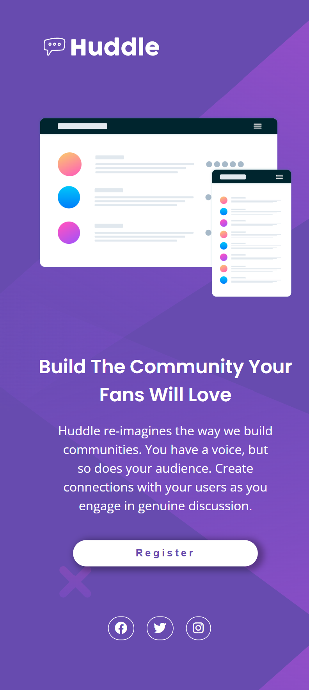

# Huddle-landing-page-with-a-single-introductory-section
------
# Frontend Mentor - Huddle landing page with single introductory section solution

This is a solution to the [Huddle landing page with single introductory section challenge on Frontend Mentor](https://www.frontendmentor.io/challenges/huddle-landing-page-with-a-single-introductory-section-B_2Wvxgi0). Frontend Mentor challenges help you improve your coding skills by building realistic projects. 

## Table of contents

- [Overview](#overview)
  - [The challenge](#the-challenge)
  - [Screenshot](#screenshot)
  - [Links](#links)
- [My process](#my-process)
  - [Built with](#built-with)
  - [What I learned](#what-i-learned)
  - [Continued development](#continued-development)
- [Author](#author)
- [Acknowledgments](#acknowledgments)

## Overview

### The challenge

Users should be able to:

- View the optimal layout for the page depending on their device's screen size
- See hover states for all interactive elements on the page

### Screenshot




### Links

- Solution URL: [(https://github.com/AmanGupta1703/Huddle-landing-page-with-a-single-introductory-section)]
- Live Site URL: [(https://amangupta1703.github.io/Huddle-landing-page-with-a-single-introductory-section/)]

## My process

### Built with

- Semantic HTML5 markup
- CSS custom properties
- Flexbox

### What I learned

To see how you can add code snippets, see below:
Some HTML code I'm proud of</h1>

```css
body {
  background: var(--violet) url("../images/bg-desktop.svg");
  font-family: var(--ff-primary);
  min-height: 100vh;
}

/* HEADER */
.header {
  margin: 4rem 0 4rem 3em;
}

/* LOGO */
.website-logo {
  width: 16rem;
}

/* CONTAINER */
.container {
  display: flex;
  gap: 3rem;
  margin: 4rem 0 4rem 3rem;
}

/* WEB-BANNER */
.banner-img {
  width: 48rem;
}

/* WEB-TEXT-CONTENT */
.web-text-content {
  margin: 3rem 0 0;
}

.big-heading {
  color: var(--white);
  font-size: 3rem;
  font-family: var(--ff-secondary);
  line-height: 1.5;
  margin: 0 0 1rem;
  padding: 0 0.4rem;
  width: 40rem;
}

.web-description {
  color: var(--white);
  margin: 0 0 1.9rem;
  line-height: 1.5;
  padding: 0 0.2rem;
  margin: 0 0 2rem 1rem;
  width: 30rem;
}

.register-btn {
  color: var(--violet);
  cursor: pointer;
  background-color: var(--white);
  border: none;
  border-radius: 10rem;
  box-shadow: 4px 2px 8px 4px rgba(0, 0, 0, 0.3);
  font-size: 1rem;
  letter-spacing: 0.2rem;
  padding: 1rem 3.5rem;
  margin: 0 0 0 1rem;
}
```

### Continued development

1) FlexBox 
2) Responsive Design

## Author

- Website - [Huddle Landing Page]((https://amangupta1703.github.io/Huddle-landing-page-with-a-single-introductory-section/))
- Frontend Mentor - [@AmanGupta1703](https://www.frontendmentor.io/profile/AmanGupta1703)
